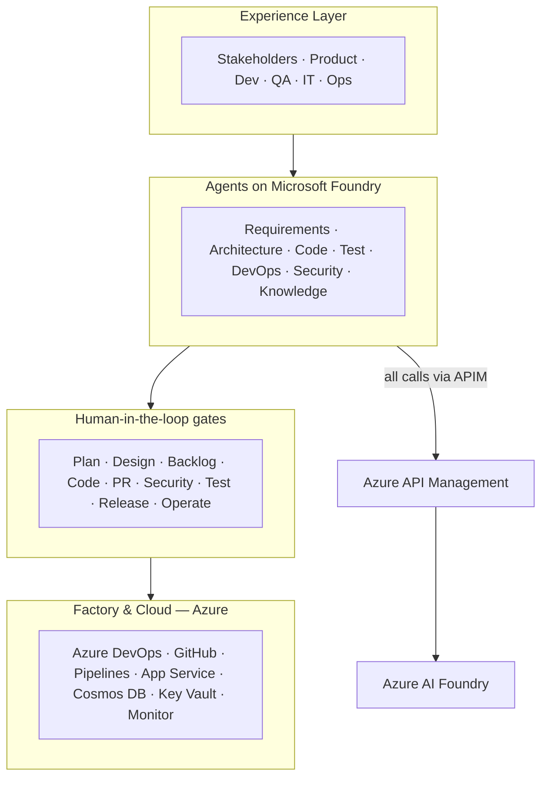
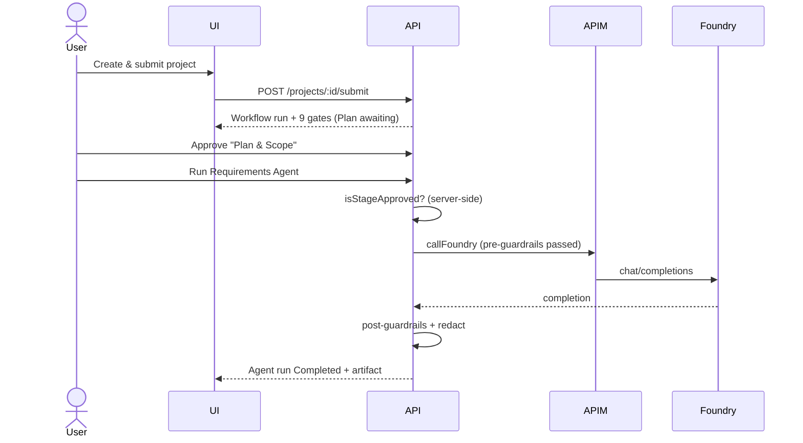

# Agentic SDLC — Software Factory

An **AI Foundry–based Software Factory**: a responsive application that
orchestrates specialized Azure AI Foundry agents across the software
development lifecycle, with **explicit human approval gates** before any agent
action advances to the next stage.

> Michael Yaacoub | Sr Solution Engineer —
> [LinkedIn](https://www.linkedin.com/in/michael-yaacoub-7a46436/) ·
> [github.com/csdmichael](https://github.com/csdmichael)

---

## Table of contents

1. [Architecture at a glance](#architecture-at-a-glance)
2. [Data flow](#data-flow)
3. [Features](#features)
4. [Technology stack](#technology-stack)
5. [Repository layout](#repository-layout)
6. [Quick start (local)](#quick-start-local)
7. [Authentication & roles](#authentication--roles)
8. [Human-in-the-loop approval gates](#human-in-the-loop-approval-gates)
9. [Specialized agents](#specialized-agents)
10. [Configuration](#configuration)
11. [Security & guardrails](#security--guardrails)
12. [Testing](#testing)
13. [Deployment (CI/CD)](#deployment-cicd)
14. [Documentation](#documentation)
15. [License](#license)

---

## Architecture at a glance

The platform follows the **AI Foundry–Based Software Factory** reference
architecture and the **Agentic SDLC: Human Accountability + Agent Execution**
operating model (source deck:
[`docs/Microsoft-AI-Stack-for-SDLC.pptx`](docs/Microsoft-AI-Stack-for-SDLC.pptx)).

<!-- After exporting the deck slides to docs/images/ (see docs/images/README.md),
     the PNGs below render inline. The Mermaid diagram is the always-available fallback. -->




Full diagrams: [docs/architecture.md](docs/architecture.md).

## Data flow

Project intake → approval gate → governed agent action, with guardrails before
and after every agent output. See [docs/dataflow.md](docs/dataflow.md).



## Features

- Responsive UI (phone / tablet / web) with role-aware navigation.
- Microsoft **Entra ID** + **email OTP** authentication.
- **New Project** wizard: intake, requirement sources (SharePoint / OneDrive /
  local upload), ADO & GitHub targets, environment, and agent selection.
- **Nine approval gates** with approve / reject / request-changes / delegate.
- **Configurable agents** — model, APIM route, tools, MCP servers, guardrails,
  token limits, and approval requirements are all data-driven.
- **APIM gateway layer** in front of Foundry with full audit logging.
- **Mock services** for ADO, GitHub, SharePoint, OneDrive, local disk,
  Foundry/APIM, and Azure provisioning so it runs with no cloud credentials.
- **Audit trail** for every user, agent, and approval action.
- App Owner **user management** (roles + authentication method).

## Technology stack

| Layer | Technology |
| --- | --- |
| Frontend | Angular 18 (standalone) + Ionic 8, responsive |
| API | Node.js / TypeScript (Express) |
| Persistence | Repository pattern — file store (local dev) / Azure Cosmos DB |
| Auth | Microsoft Entra ID + email OTP (Azure Communication Services) |
| Gateway | Azure API Management in front of Azure AI Foundry |
| Hosting | Azure App Service (B2 plan) |

## Repository layout

```
Foundry-Agentic-Workflow-SDLC/
├─ src/                      # Angular/Ionic UI
│  └─ app/
│     ├─ config/            # UI tier config
│     ├─ models/  services/  guards/  shell/  pages/
├─ api/                      # Node/TypeScript API
│  └─ src/
│     ├─ config/            # API tier config (+ APIM, integrations, guardrails)
│     ├─ persistence/config # DB tier config
│     ├─ agents/config      # Agent orchestration tier config
│     ├─ middleware/  routes/  services/  models/
│     └─ __tests__/
├─ .github/workflows/        # Component-scoped CI/CD (deploy only what changed)
└─ docs/                     # Architecture, data flow, config, security, troubleshooting
```

## Quick start (local)

Prerequisites: Node.js 20+.

```powershell
# 1) API
cd api
npm install
Copy-Item .env.example .env      # dev defaults: OTP bypass on, file persistence
npm run dev                       # http://localhost:8080

# 2) UI (new terminal, repo root)
npm install
npm start                         # http://localhost:8100 (proxies /api -> :8080)
```

Sign in with any email and OTP `000000` (dev bypass), or one of the seeded App
Owners. First run seeds the App Owners from
[`api/src/config/seed-users.json`](api/src/config/seed-users.json).

## Authentication & roles

Two flows: **Entra ID** (MSAL bearer token validated against tenant JWKS) and
**email OTP** (SHA-256 hashed codes with TTL and rate limiting; app JWT issued
on verify). Roles: **Business User**, **IT User**, **Admin**, **App Owner**.
Details in [docs/security-and-guardrails.md](docs/security-and-guardrails.md).

Seeded App Owners:

- `admin@MngEnvMCAP829495.onmicrosoft.com` (Entra ID)
- `myaacoub@MngEnvMCAP829495.onmicrosoft.com` (Entra ID)
- `myaacoub@microsoft.com` (OTP)

## Human-in-the-loop approval gates

Plan & Scope · Architecture & Design · Backlog Generation · Code Generation ·
Pull Request · Security Review · Test Acceptance · Release & Deployment ·
Operate & Improve.

No agent advances a stage when `requiresHumanApproval` is true and approval is
missing — enforced **server-side** so bypassing the UI cannot bypass approvals.
Each decision records approver, role, timestamp, decision, comments,
previous/next state, and artifact references.

## Specialized agents

Requirements · Architecture Advisor · Code Generation · Test Automation ·
DevOps / Release · Security & Compliance · Knowledge Assistant. Each is
configured in
[`api/src/agents/config/agents.config.json`](api/src/agents/config/agents.config.json)
and editable in **Admin ▸ Agent Configuration**.

## Configuration

Configuration is separated by tier (UI / API / DB / agent), and **no secrets are
committed**. See [docs/configuration-guide.md](docs/configuration-guide.md) and
[`api/.env.example`](api/.env.example).

## Security & guardrails

Content-safety, PII-redaction, and secret-scanning guardrails run before and
after each agent output; correlation IDs flow UI → API → APIM → agents → audit.
See [docs/security-and-guardrails.md](docs/security-and-guardrails.md).

## Testing

```powershell
cd api
npm test    # authorization (RBAC), approval-gate enforcement, workflow state transitions
```

## Deployment (CI/CD)

Component-scoped workflows deploy **only the changed component** using path
filters and Azure OIDC federated login (no stored client secrets):

- [`.github/workflows/deploy-ui.yml`](.github/workflows/deploy-ui.yml) — on `src/**` changes.
- [`.github/workflows/deploy-api.yml`](.github/workflows/deploy-api.yml) — on `api/**` changes.
- [`.github/workflows/ci.yml`](.github/workflows/ci.yml) — build + test both on PRs.

Set repository variables `UI_WEBAPP_NAME` / `API_WEBAPP_NAME` and secrets
`AZURE_CLIENT_ID`, `AZURE_TENANT_ID`, `AZURE_SUBSCRIPTION_ID`.

## Documentation

| Topic | Link |
| --- | --- |
| Architecture | [docs/architecture.md](docs/architecture.md) |
| Data flow | [docs/dataflow.md](docs/dataflow.md) |
| Configuration guide | [docs/configuration-guide.md](docs/configuration-guide.md) |
| Security & guardrails | [docs/security-and-guardrails.md](docs/security-and-guardrails.md) |
| Troubleshooting | [docs/troubleshooting.md](docs/troubleshooting.md) |

## License

[MIT](LICENSE) © 2026 Michael Yaacoub (Microsoft).
