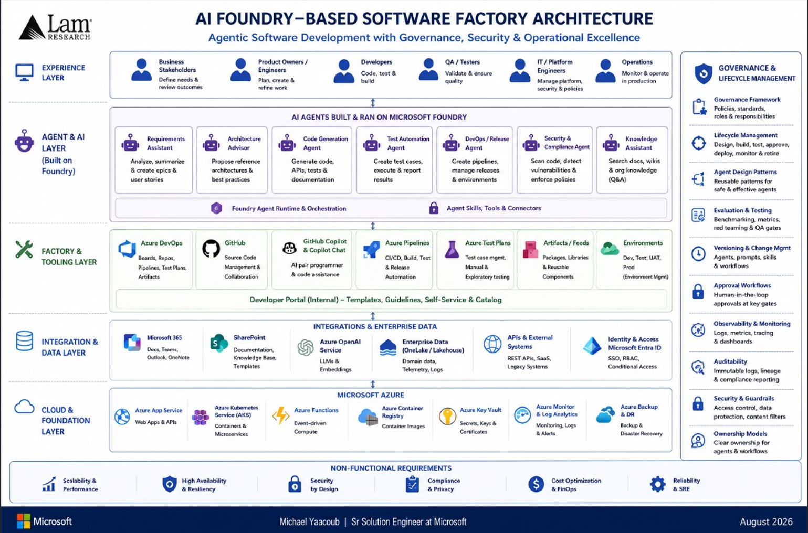
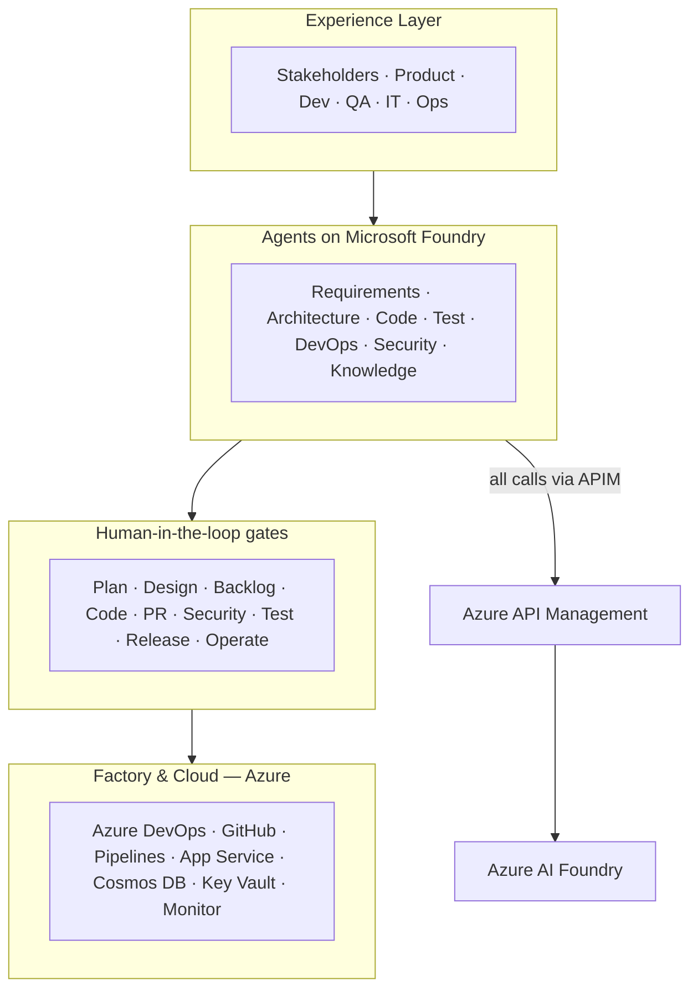
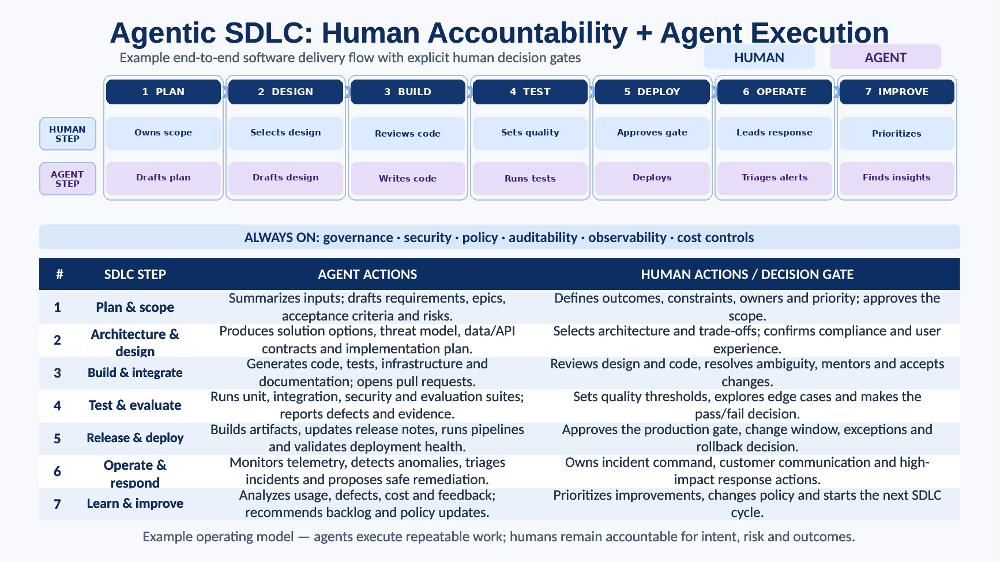
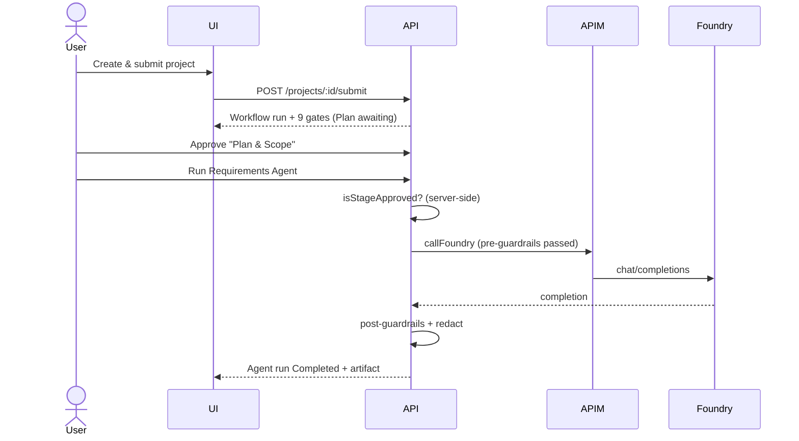

# Agentic SDLC — Software Factory

An **AI Foundry–based Software Factory**: a responsive application that
orchestrates specialized Azure AI Foundry agents across the software
development lifecycle, with **explicit human approval gates** before any agent
action advances to the next stage.

> Michael Yaacoub | Sr Solution Engineer —
> [LinkedIn](https://www.linkedin.com/in/michael-yaacoub-7a46436/) ·
> [github.com/csdmichael/Foundry-Agentic-Workflow-SDLC](https://github.com/csdmichael/Foundry-Agentic-Workflow-SDLC)

---

## Table of contents

1. [Live deployment](#live-deployment)
2. [Architecture at a glance](#architecture-at-a-glance)
3. [Data flow](#data-flow)
4. [Agent Framework workflow](#agent-framework-workflow)
5. [Features](#features)
6. [Technology stack](#technology-stack)
7. [Repository layout](#repository-layout)
8. [Quick start (local)](#quick-start-local)
9. [Authentication & roles](#authentication--roles)
10. [Human-in-the-loop approval gates](#human-in-the-loop-approval-gates)
11. [Specialized agents](#specialized-agents)
12. [Systems of Record](#systems-of-record)
13. [Configuration](#configuration)
14. [Security & guardrails](#security--guardrails)
15. [Testing](#testing)
16. [Deployment (CI/CD)](#deployment-cicd)
17. [Documentation](#documentation)
18. [References](#references)
19. [License](#license)

---

## Live deployment

Published to **Azure App Service** (Linux, B2 plan `agentic-sdlc-plan`) in
resource group **ai-myaacoub** (West US 2), subscription
`86b37969-9445-49cf-b03f-d8866235171c`. Component-scoped GitHub Actions redeploy
only the changed tier using Azure **OIDC federated login** (no stored secrets).

| Resource | URL |
| --- | --- |
| UI (Angular/Ionic) | <https://agentic-sdlc-ui-my.azurewebsites.net> |
| API (FastAPI) | <https://agentic-sdlc-api-my.azurewebsites.net> |
| API health probe | <https://agentic-sdlc-api-my.azurewebsites.net/api/health> |
| API Swagger / OpenAPI UI | <https://agentic-sdlc-api-my.azurewebsites.net/docs> |
| API OpenAPI schema (JSON) | <https://agentic-sdlc-api-my.azurewebsites.net/openapi.json> |
| Foundry agents (project) | <https://002-ai-poc-private.services.ai.azure.com/api/projects/proj-default> |

Azure management (portal) links:

| Resource | Portal |
| --- | --- |
| Resource group `ai-myaacoub` | [open](https://portal.azure.com/#@MngEnvMCAP829495.onmicrosoft.com/resource/subscriptions/86b37969-9445-49cf-b03f-d8866235171c/resourceGroups/ai-myaacoub/overview) |
| API web app | [open](https://portal.azure.com/#@MngEnvMCAP829495.onmicrosoft.com/resource/subscriptions/86b37969-9445-49cf-b03f-d8866235171c/resourceGroups/ai-myaacoub/providers/Microsoft.Web/sites/agentic-sdlc-api-my/appServices) |
| UI web app | [open](https://portal.azure.com/#@MngEnvMCAP829495.onmicrosoft.com/resource/subscriptions/86b37969-9445-49cf-b03f-d8866235171c/resourceGroups/ai-myaacoub/providers/Microsoft.Web/sites/agentic-sdlc-ui-my/appServices) |
| APIM gateway `ai-gateway-apim-poc-my` | [open](https://portal.azure.com/#@MngEnvMCAP829495.onmicrosoft.com/resource/subscriptions/86b37969-9445-49cf-b03f-d8866235171c/resourceGroups/ai-myaacoub/providers/Microsoft.ApiManagement/service/ai-gateway-apim-poc-my/apim-apis) |
| Cosmos DB `cosmos-fabriciq-demo-01` | [open](https://portal.azure.com/#@MngEnvMCAP829495.onmicrosoft.com/resource/subscriptions/86b37969-9445-49cf-b03f-d8866235171c/resourceGroups/ai-myaacoub/providers/Microsoft.DocumentDB/databaseAccounts/cosmos-fabriciq-demo-01/DataExplorerBlade) |
| Email (ACS) `fabriciq-shortages-email-b3` | [open](https://portal.azure.com/#@MngEnvMCAP829495.onmicrosoft.com/resource/subscriptions/86b37969-9445-49cf-b03f-d8866235171c/resourceGroups/ai-myaacoub/providers/Microsoft.Communication/EmailServices/fabriciq-shortages-email-b3/resourceOverviewId) |

> The Python API migration is in progress: the published API currently exposes
> the health probe and Swagger docs. The UI is served as a static SPA — point its
> `apiBaseUrl` in [`src/app/config/ui.config.ts`](src/app/config/ui.config.ts) at
> the API host once the remaining endpoints are ported.

---

## Architecture at a glance


Agents are **built, run, and governed in Microsoft Foundry**, orchestrated with
**Microsoft Agent Framework**, and they reach the outside world only by calling
**Systems of Record through MCP servers and APIs**. Reading the diagram
top-to-bottom:

**1 · People (top band).** Six personas hold accountability across the lifecycle —
Business Stakeholders, Product Owners/Managers, Developers, QA/Testers,
DevOps/Platform Engineers, and Operations. Every persona maps to a role in the
app ([Authentication & roles](#authentication--roles)) and to the approver of
one or more gates.

**2 · Microsoft Agent Framework in Foundry (runtime band).** The framework
supplies built-in orchestration patterns, context & state management, guardrails
& safety, tools & connectors, and observability & logging. This is why the app
does not hand-roll an orchestrator — see
[Agent Framework workflow](#agent-framework-workflow) for the pattern chosen.

**3 · Foundry agents for SDLC (center).** Seven phases, each with one owning
agent and its own persisted state:

| # | Phase | Agent | Produces |
| --- | --- | --- | --- |
| 1 | Plan & Scope | Planning Agent | Requirements understanding, epics & user stories, estimates |
| 2 | Design | Architecture Agent | Solution architecture, data & API contracts, security/threat model |
| 3 | Build | Code Generation Agent | Code, unit tests, code-review suggestions |
| 4 | Test | Test Automation Agent | Test cases & plans, execution, defect reports |
| 5 | Deploy | Deployment Agent | Build & package, pipelines / GitHub Actions, deploy to Azure |
| 6 | Operate | Ops Monitoring Agent | Health & performance, alerts & incident triage, auto-remediation |
| 7 | Improve | Insights Agent | Metrics & feedback analysis, risks, next-action recommendations |

A **Shared Context & State** bus runs underneath all seven so an agent inherits
what earlier phases produced instead of re-deriving it. In this implementation
the lifecycle adds an explicit `security` stage between deploy and operate, and
the seven phases are fronted by **nine approval gates** — no agent advances
itself ([Human-in-the-loop approval gates](#human-in-the-loop-approval-gates)).

**4 · Agents call Systems of Record via MCP servers & APIs (bottom).** Agents
never own data. Each integration is a governed connector: SharePoint
(documentation), Azure DevOps (work items; test cases & plans), Azure DevOps /
GitHub Actions (pipelines & automations), GitHub (source control), GitHub Copilot
(coding assistant), and Microsoft Azure (App Services, Functions, Containers,
Key Vault, Monitor).

**5 · Global settings ▸ Project settings (right rail).** The five Systems of
Record are configured once globally and **pre-populated, overridable per
project** — implemented exactly as shown in [Systems of Record](#systems-of-record).

**6 · Governance & security (right rail, bottom).** RBAC & least privilege, data
policies & compliance, audit logging & observability, security scanning &
guardrails, and cost controls. These are cross-cutting, enforced server-side, and
cannot be bypassed from the UI ([Security & guardrails](#security--guardrails)).

The outcome band across the bottom — consistency & reuse, end-to-end
traceability, faster delivery, quality & reliability, visibility & insights, and
secure & governed operation — is what the approval-gated design is optimizing for.

### Reference architecture

The platform follows the **AI Foundry–Based Software Factory** reference
architecture and the **Agentic SDLC: Human Accountability + Agent Execution**
operating model (full deck:
[`docs/Microsoft-AI-Stack-for-SDLC.pdf`](docs/Microsoft-AI-Stack-for-SDLC.pdf)).





Full diagrams: [docs/architecture.md](docs/architecture.md).

## Data flow

Project intake → approval gate → governed agent action, with guardrails before
and after every agent output. See [docs/dataflow.md](docs/dataflow.md).





  ## Agent Framework workflow

  Microsoft Agent Framework offers five multi-agent orchestration patterns:

  

  | Pattern | Shape | Fit for a governed SDLC |
  | --- | --- | --- |
  | **Sequential** | Agents run one after another, each building on the previous output | **Chosen.** The SDLC is inherently ordered — plan → design → build → test → security → deploy — and each stage needs a named approval gate between steps |
  | Concurrent | Agents run in parallel on the same input, results are aggregated | No single accountable owner per step; hard to place a gate |
  | Group Chat | Agents converse in a shared thread under a chat manager | Non-deterministic turn order; audit trail is a transcript, not a state machine |
  | Handoff | Agents dynamically transfer control to each other | Control transfers are agent-decided, which would bypass human gates |
  | Magentic | An orchestrator plans and delegates open-ended work | Plan is generated at runtime, so the approval sequence cannot be fixed in advance |

  ### Approach used: Sequential with human-in-the-loop checkpoints

  This platform uses the **Sequential** pattern, extended with Agent Framework
  `RequestInfo` request/response semantics so the graph **pauses at an approval
  gate and resumes after a human decision**. That combination is what makes the
  SDLC governable: stage order is deterministic, every transition is auditable,
  and no agent can advance itself.

  Each governed action runs as an Agent Framework graph implemented in
  [`api/app/agent_workflow.py`](api/app/agent_workflow.py):

  ```mermaid
  flowchart LR
    I[Project + agent request] --> H[Approval executor]
    H -->|approved| A[APIM agent executor]
    H -->|missing approval| R[RequestInfo event + checkpoint]
    A --> G[Guardrails + APIM to Foundry]
    G --> X[Governed integration executor]
    X --> O[Artifact + audit + external references]
  ```

  The approval executor uses Agent Framework request/response semantics. Pending
  requests and graph state are checkpointed under the configured persistence root,
  so a run can wait indefinitely for an approver without holding a connection.
  The HTTP API preserves its non-bypassable `403` contract until the named gate is
  approved. Model execution remains behind APIM; the framework does not introduce
  a direct Foundry path.


## Features

- Responsive UI (phone / tablet / web) with role-aware navigation.
- Microsoft **Entra ID** + **email OTP** authentication.
- **New Project** wizard: intake, requirement sources (SharePoint / OneDrive /
  local upload), ADO & GitHub targets, environment, and agent selection.
- **Nine approval gates** with approve / reject / request-changes / delegate.
- **Configurable agents** — model, APIM route, tools, MCP servers, guardrails,
  token limits, and approval requirements are all data-driven.
- **APIM gateway layer** in front of Foundry with full audit logging.
- **Mock-safe and live connectors** for ADO, GitHub, SharePoint, test automation,
  OneDrive, local disk, Foundry/APIM, and Azure provisioning.
- **Audit trail** for every user, agent, and approval action.
- App Owner **user management** (roles + authentication method).

## Technology stack

| Layer | Technology |
| --- | --- |
| Frontend | Angular 18 (standalone) + Ionic 8, responsive |
| API | Python 3.13 / FastAPI (Uvicorn + Gunicorn) |
| Persistence | Repository pattern — file store (local dev) / Azure Cosmos DB |
| Auth | Microsoft Entra ID + email OTP (Azure Communication Services) |
| Gateway | Azure API Management in front of Azure AI Foundry |
| Hosting | Azure App Service (B2 plan) |

## Repository layout

```
Foundry-Agentic-Workflow-SDLC/
├─ src/                      # Angular/Ionic UI
│  └─ app/
│     ├─ config/            # UI tier config
│     ├─ models/  services/  guards/  shell/  pages/
├─ api/                      # FastAPI/Python API
│  ├─ app/                  # Routes, services, Agent Framework workflow
│  ├─ tests/                # Python API tests
│  └─ src/                  # Shared tier config and legacy TS reference
│     ├─ config/            # API tier config (+ APIM, integrations, guardrails)
│     ├─ persistence/config # DB tier config
│     └─ agents/config      # Agent orchestration tier config
├─ .github/workflows/        # Component-scoped CI/CD (deploy only what changed)
└─ docs/                     # Architecture, data flow, config, security, troubleshooting
```

## Quick start (local)

Prerequisites: Python 3.13+ and Node.js 20+.

```powershell
# 1) API
cd api
python -m venv .venv
.venv\Scripts\python -m pip install -r requirements.txt
Copy-Item .env.example .env
.venv\Scripts\python -m uvicorn app.main:app --reload --port 8080

# 2) UI (new terminal, repo root)
npm install
npm start                         # http://localhost:8100 (proxies /api -> :8080)
```

Sign in with any email and OTP `000000` (dev bypass), or one of the seeded App
Owners. First run seeds the App Owners from
[`api/src/config/seed-users.json`](api/src/config/seed-users.json).

## Authentication & roles

Two flows: **Entra ID** (MSAL bearer token validated against tenant JWKS) and
**email OTP** (SHA-256 hashed codes with TTL and rate limiting; app JWT issued
on verify). Roles: **Business User**, **IT User**, **Admin**, **App Owner**.
Details in [docs/security-and-guardrails.md](docs/security-and-guardrails.md).

Seeded App Owners:

- `admin@MngEnvMCAP829495.onmicrosoft.com` (Entra ID)
- `myaacoub@MngEnvMCAP829495.onmicrosoft.com` (Entra ID)
- `myaacoub@microsoft.com` (OTP)

## Human-in-the-loop approval gates

Plan & Scope · Architecture & Design · Backlog Generation · Code Generation ·
Pull Request · Security Review · Test Acceptance · Release & Deployment ·
Operate & Improve.

No agent advances a stage when `requiresHumanApproval` is true and approval is
missing — enforced **server-side** so bypassing the UI cannot bypass approvals.
Each decision records approver, role, timestamp, decision, comments,
previous/next state, and artifact references.

## Specialized agents

Requirements · Planning · Architecture Advisor · Code Generation · Test
Planning · Testing · Test Automation · DevOps / Release · Security & Compliance
· Knowledge Assistant. Each is
configured in
[`api/src/agents/config/agents.config.json`](api/src/agents/config/agents.config.json)
and editable in **Admin ▸ Agent Configuration**.

Configured governed destinations:

- Requirements assets: a project-named folder below the Manufacturing & Mobility
  SharePoint `Projects` folder.
- Planning output: an Azure DevOps project in `https://dev.azure.com/csdmichael`
  with Epic → Feature → User Story → Task hierarchy.
- Coding output: a private repository in the `csdmichael` GitHub organization;
  generated output is committed but never auto-merged.
- Test planning and execution: Azure Test Plans/test cases, then Azure Pipelines
  or GitHub Actions according to `testAutomation.defaultRunner`.

## Systems of Record

Global settings define where each class of SDLC output is tracked. **Every
project inherits them unless it overrides a specific row.**

| System of Record | Default | Alternatives |
| --- | --- | --- |
| Documentation | SharePoint URL | Azure DevOps Wiki, GitHub Wiki |
| Work Items Tracking | `https://dev.azure.com/{orgName}` | GitHub Issues |
| Test Cases & Test Plans Tracking | `https://dev.azure.com/{orgName}` | GitHub Issues |
| Code Build / Pipelines | `https://dev.azure.com/{orgName}` | GitHub Actions |
| Source Code Org | `https://github.com/{orgName}` | Azure Repos |

- **Defaults** live in
  [`api/src/config/systems-of-record.config.json`](api/src/config/systems-of-record.config.json).
  Its `catalog` block drives both the UI form and server-side provider validation.
- **Global overrides** are edited under **Admin ▸ Global Settings**
  (`config.manage` capability) and stored in the persistence tier.
- **Project overrides** are set in the New Project wizard (pre-populated from the
  global values) and on the project detail page (`projects.manage` capability).
  Only overridden keys are stored; the rest keep inheriting.

Resolution order is `config default → global override → project override`. The
API rejects unknown keys, unsupported providers, and non-`https://` URLs, and
audits every settings change.

## Configuration

Configuration is separated by tier (UI / API / DB / agent), and **no secrets are
committed**. See [docs/configuration-guide.md](docs/configuration-guide.md) and
[`api/.env.example`](api/.env.example).

## Security & guardrails

Content-safety, PII-redaction, and secret-scanning guardrails run before and
after each agent output; correlation IDs flow UI → API → APIM → agents → audit.
See [docs/security-and-guardrails.md](docs/security-and-guardrails.md).

## Testing

```powershell
cd api
python -m pytest -q
```

## Deployment (CI/CD)

Component-scoped workflows deploy **only the changed component** using path
filters and Azure OIDC federated login (no stored client secrets):

- [`.github/workflows/deploy-ui.yml`](.github/workflows/deploy-ui.yml) — on `src/**` changes.
- [`.github/workflows/deploy-api.yml`](.github/workflows/deploy-api.yml) — on `api/**` changes.
- [`.github/workflows/ci.yml`](.github/workflows/ci.yml) — build + test both on PRs.

Set repository variables `UI_WEBAPP_NAME` / `API_WEBAPP_NAME` and secrets
`AZURE_CLIENT_ID`, `AZURE_TENANT_ID`, `AZURE_SUBSCRIPTION_ID` (environment-scoped
secrets on the `production` environment take precedence over repository-scoped ones).

GitHub issues **ID-qualified OIDC subjects**, so the Entra app registration needs a
federated credential whose subject includes the owner and repository IDs:

```
repo:<owner>@<ownerId>/<repo>@<repoId>:environment:production
```

A legacy `repo:<owner>/<repo>:environment:production` credential alone fails with
`AADSTS700213`.

## Documentation

| Topic | Link |
| --- | --- |
| High-level architecture (main diagram) | [docs/HL Architecture.png](docs/HL%20Architecture.png) |
| Agent Framework orchestration patterns | [docs/MultiAgent Workflow using Microsoft Agent Framework.jpg](docs/MultiAgent%20Workflow%20using%20Microsoft%20Agent%20Framework.jpg) |
| Architecture | [docs/architecture.md](docs/architecture.md) |
| Data flow | [docs/dataflow.md](docs/dataflow.md) |
| Configuration guide | [docs/configuration-guide.md](docs/configuration-guide.md) |
| Security & guardrails | [docs/security-and-guardrails.md](docs/security-and-guardrails.md) |
| Troubleshooting | [docs/troubleshooting.md](docs/troubleshooting.md) |

## References

- [Agents in Workflows | Microsoft Learn](https://learn.microsoft.com/en-us/agent-framework/workflows/agents-in-workflows?pivots=programming-language-csharp)
- [Microsoft Multi-Agent Custom Automation Engine Solution Accelerator](https://github.com/microsoft/Multi-Agent-Custom-Automation-Engine-Solution-Accelerator)

## License

[MIT](LICENSE) © 2026 Michael Yaacoub (Microsoft).
