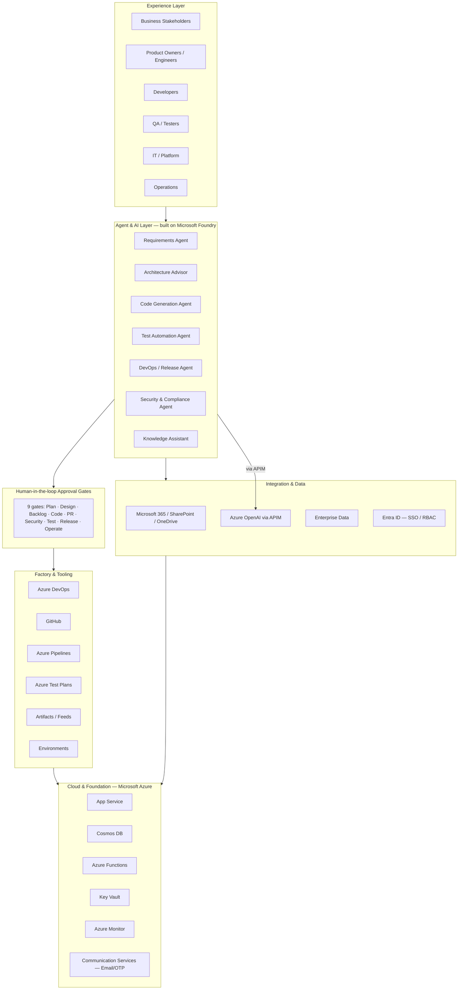

# Architecture

The Agentic SDLC / Software Factory is an AI Foundry–based platform that orchestrates
specialized agents across the software development lifecycle, with explicit
human accountability at every stage.

> The reference architecture and the "Agentic SDLC: Human Accountability + Agent
> Execution" operating model are captured in
> [`Microsoft-AI-Stack-for-SDLC.pptx`](./Microsoft-AI-Stack-for-SDLC.pptx). Export
> the two slides as PNGs into [`images/`](./images) to display them inline (see
> [images/README.md](./images/README.md)). The Mermaid diagrams below reproduce
> the same model and render directly on GitHub.

## Layered architecture

## Tiered configuration

Configuration is strictly separated by tier; business logic never hardcodes
endpoints, keys, tenant IDs, or routes.

| Tier | Config location |
| --- | --- |
| UI | [`src/app/config/`](../src/app/config) |
| API | [`api/src/config/`](../api/src/config) |
| DB / persistence | [`api/src/persistence/config/`](../api/src/persistence/config) |
| Agent orchestration | [`api/src/agents/config/`](../api/src/agents/config) |

## APIM gateway

All Azure AI Foundry calls route through Azure API Management. The backend never
calls Foundry directly except when `FOUNDRY_ALLOW_DIRECT=1` is set for local
development. Every call logs prompt ID, agent ID, model name, token estimate,
project ID, user ID, approval gate ID, workflow run ID, and correlation ID.
