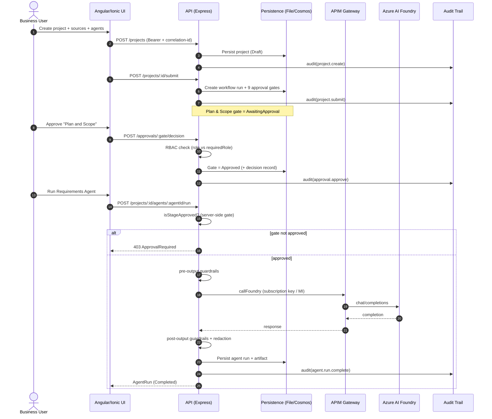
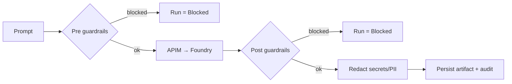

# Data flow

End-to-end flow from project intake to a governed agent action, showing where
human approval gates interrupt automated execution.

```mermaid
sequenceDiagram
  autonumber
  actor BU as Business User
  participant UI as Angular/Ionic UI
  participant API as API (Express)
  participant DB as Persistence (File/Cosmos)
  participant APIM as APIM Gateway
  participant FDY as Azure AI Foundry
  participant AUD as Audit Trail

  BU->>UI: Create project + sources + agents
  UI->>API: POST /projects (Bearer + correlation-id)
  API->>DB: Persist project (Draft)
  API->>AUD: audit(project.create)
  UI->>API: POST /projects/:id/submit
  API->>DB: Create workflow run + 9 approval gates
  API->>AUD: audit(project.submit)

  Note over API,DB: Plan & Scope gate = AwaitingApproval

  BU->>UI: Approve "Plan and Scope"
  UI->>API: POST /approvals/:gate/decision
  API->>API: RBAC check (role vs requiredRole)
  API->>DB: Gate = Approved (+ decision record)
  API->>AUD: audit(approval.approve)

  BU->>UI: Run Requirements Agent
  UI->>API: POST /projects/:id/agents/:agentId/run
  API->>API: isStageApproved? (server-side gate)
  alt gate not approved
    API-->>UI: 403 ApprovalRequired
  else approved
    API->>API: pre-output guardrails
    API->>APIM: callFoundry (subscription key / MI)
    APIM->>FDY: chat/completions
    FDY-->>APIM: completion
    APIM-->>API: response
    API->>API: post-output guardrails + redaction
    API->>DB: Persist agent run + artifact
    API->>AUD: audit(agent.run.complete)
    API-->>UI: AgentRun (Completed)
  end
```

## Guardrail enforcement points

```mermaid
flowchart LR
  P[Prompt] --> PRE{Pre guardrails}
  PRE -- blocked --> B1[Run = Blocked]
  PRE -- ok --> APIM[APIM → Foundry]
  APIM --> POST{Post guardrails}
  POST -- blocked --> B2[Run = Blocked]
  POST -- ok --> RED[Redact secrets/PII]
  RED --> ART[Persist artifact + audit]
```
